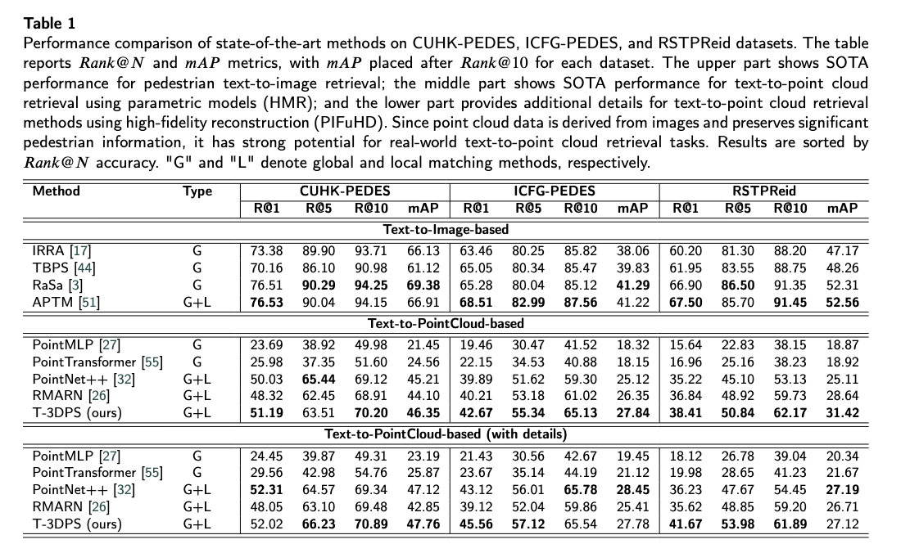

# T3DPS

# Text-based Three-dimensional Geometric Person Retrieval

[](#citation)
[](#license)
[](#installation)

Official implementation of **Text-based Three-dimensional Geometric Person Retrieval** (Engineering Applications of Artificial Intelligence, EAAI).

> 🚧 This repository is under active maintenance. Code/models will be released progressively.

---

## Highlights
- Pioneering integration of textual descriptions with synthesized 3D geometric pedestrian data for text-based person re-identification.
- Novel framework that leverages complementary strengths of text semantics and 3D geometry to address resolution, viewpoint, and occlusion challenges.
- Extensive experiments on three public datasets demonstrate competitive performance and practical applicability in real-world scenarios.

---

## News
- **2026-02-18**: Repository initialized.
- ...

---

## Method Overview
<p align="center">
  
</p>

---

## Results
<p align="center">
  
</p>

## Environment
- OS: Linux/macOS/Windows
- Python: 3.9+
- PyTorch: 2.x
- CUDA: 11.x (optional, recommended)

---

## Installation
```bash
git clone https://github.com/fonsjiang/T3DPS.git
cd T3DPS

# (Recommended) create env
conda create -n t3dpr python=3.10 -y
conda activate t3dpr

# install deps
pip install -r requirements.txt
